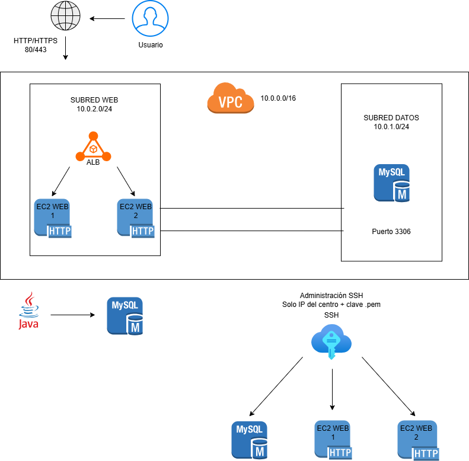

# RETO-DAM1-Equipo3

## Gestión y Localización del Material del Taller de Informática

---

## Índice

1. [Descripción del reto](#descripción-del-reto)
2. [Objetivos del proyecto](#objetivos-del-proyecto)
3. [Integrantes del equipo](#integrantes-del-equipo)
4. [Tecnologías utilizadas](#tecnologías-utilizadas)
5. [Arquitectura del proyecto](#arquitectura-del-proyecto)
6. [Base de datos](#base-de-datos)
7. [Aplicación de escritorio](#aplicación-de-escritorio)
8. [Sitio web](#sitio-web)
9. [Infraestructura AWS](#infraestructura-aws)
10. [Diagramas](#diagramas)
11. [Resultados obtenidos](#resultados-obtenidos)
12. [Guía de despliegue](#guía-de-despliegue)
13. [Manual de usuario](#manual-de-usuario)
14. [Organización del equipo](#organización-del-equipo)
15. [Valoración del proyecto](#valoración-del-proyecto)
16. [Mejoras futuras](#mejoras-futuras)
17. [Webgrafía](#webgrafía)
18. [Licencia](#licencia)

---

## Descripción del reto

El proyecto "Gestión y Localización del Material del Taller de Informática" consiste en el desarrollo de una aplicación de escritorio en Java conectada a una base de datos MySQL desplegada en AWS Academy.

La aplicación permite gestionar el inventario del taller de Informática del IES Miguel Herrero Pereda, facilitando:
- el control del material,
- la localización física de componentes,
- la gestión de préstamos,
- la generación de informes,
- y la visualización gráfica del taller mediante un sitio web HTML/CSS.

La infraestructura del proyecto se encuentra desplegada sobre instancias EC2 en AWS Academy.

## Objetivos del proyecto

- Diseñar una base de datos relacional en MySQL.
- Crear una aplicación Java orientada a objetos.
- Implementar patrón DAO y Singleton.
- Gestionar inventario y préstamos.
- Crear un sitio web de visualización.
- Desplegar infraestructura AWS.
- Trabajar colaborativamente con GitHub.
- Documentar el proyecto profesionalmente.

## Integrantes del equipo

- Saúl Valdunciel
- Naya Ruiz
- Ciro Galán
- Manuel González
- Hugo Fernández

## Tecnologías utilizadas

| Tecnología | Uso |
|---|---|
| Java | Aplicación escritorio |
| Swing | Interfaz gráfica |
| MySQL | Base de datos |
| JDBC | Conexión Java-BD |
| HTML5 | Sitio web |
| CSS3 | Diseño visual |
| XML/XSLT | Exportación de datos |
| Git y GitHub | Control de versiones |
| AWS Academy | Infraestructura cloud |
| EC2 | Servidores |
| Apache/Nginx | Servidor web |
| OpenSSH/SFTP | Transferencia de archivos |
| NetBeans | IDE Java |
| VS Code | Desarrollo web y Markdown |
| MySQL Workbench | Gestión BD |

## Arquitectura del proyecto

El proyecto está dividido en varios módulos:

- Base de datos MySQL
- Aplicación Java Swing
- Sitio web HTML/CSS
- Infraestructura AWS
- Documentación técnica

## Base de datos

La base de datos fue desarrollada en MySQL y diseñada para gestionar:
- materiales,
- categorías,
- ubicaciones,
- préstamos,
- usuarios,
- movimientos.

- [Ver Diagrama E/R](#diagrama-er)
- [Ver Modelo relacional](#modelo-relacional)

## Triggers implementados

- Control de stock mínimo
- Registro automático de movimientos

## Aplicación de escritorio

La aplicación fue desarrollada en Java utilizando Swing y NetBeans.

- [Ver Diagrama de clases](#diagrama-de-clases)
- [Ver Diagrama de casos de uso](#diagrama-de-casos-de-uso)

## Características

- Login por roles
- CRUD de inventario
- Gestión de préstamos
- Búsquedas y filtros
- Informes
- Exportación CSV/Excel
- Localización de material

## Patrones utilizados

- Singleton
- DAO

## Sitio web

El sitio web fue desarrollado utilizando HTML5 y CSS3.

Permite visualizar:
- distribución del taller,
- armarios,
- baldas,
- ubicación del material.

## Infraestructura AWS

La infraestructura cloud fue desplegada en AWS Academy.

- [Ver Diagrama de arquitectura AWS](#diagrama-de-arquitectura-de-los-servidores)

## Arquitectura

- VPC dedicada
- Internet Gateway
- Dos subredes públicas
- EC2-1: servidor MySQL
- EC2-2: servidor web Apache/Nginx + SFTP
- Elastic IP
- Security Groups

## Servicios desplegados

### EC2-1
- Ubuntu Server
- MySQL Server

### EC2-2
- Apache/Nginx
- OpenSSH
- SFTP

## Diagramas

### Diagrama de casos de uso

Este diagrama representa los actores principales de la aplicación y las acciones que puede realizar cada uno.  
Se diferencian los perfiles de Usuario, Profesor y Administrador, mostrando funcionalidades como iniciar sesión, 
consultar inventario, filtrar materiales, modificar material, gestionar ubicaciones, generar informes, importar/exportar inventario y gestionar usuarios.

---

### Diagrama E/R

El diagrama entidad-relación representa la estructura lógica de la base de datos del sistema de inventario.  
En él aparecen las entidades principales del proyecto, como usuario, material, ubicación, movimiento y alerta de stock, junto con sus relaciones.

---

### Modelo relacional

El modelo relacional muestra cómo se implementa la base de datos en MySQL, indicando las tablas, claves primarias, 
claves foráneas, tipos de datos y relaciones entre las entidades.

---

### Diagrama de clases

El diagrama de clases representa la estructura orientada a objetos de la aplicación Java.  
Incluye las clases principales del sistema, como Usuario, Administrador, Profesor, Inventario, Material, 
Ubicación y las clases DAO encargadas del acceso a la base de datos.

---

### Diagrama de arquitectura de los servidores

El diagrama de arquitectura de los servidores muestra la infraestructura desplegada para el reto: VPC, subredes públicas, instancias EC2, servidor de base de datos, servidores web, balanceador de carga, Elastic IP y reglas principales de acceso.

## Resultados obtenidos

- Aplicación Java funcional
- Base de datos conectada a AWS
- Sitio web operativo
- Infraestructura EC2 desplegada
- Sistema SFTP funcionando
- CRUD operativo

## Guía de despliegue

La guía de despliegue documenta la configuración de la infraestructura en AWS, incluyendo VPC, subredes, instancias EC2, MySQL, Apache, SSH, SFTP, Security Groups y balanceador de carga.

[📄 Ver Guía de despliegue](Guia_despliegue_Equipo3.pdf)

---

## Manual de usuario

El manual de usuario explica el funcionamiento de la aplicación de escritorio, sus requisitos, perfiles de usuario, opciones disponibles y generación de informes.

[📄 Ver Manual de usuario](docs/Manual_usuario_Equipo3.pdf)

---

## Documentación de la web

La documentación de la página web explica la estructura, y el funcionamiento interno de la web, los lengujes utilizados y el funcinamiento de esta.

[📄 Ver Documentación de la web](Documentación_Técnica_Web.pdf)

## Organización del equipo

El equipo utilizó:
- GitHub Projects
- GitHub Issues
- GitHub Wiki
- reuniones diarias
- control de tareas colaborativo

## Valoración del proyecto

El reto permitió aplicar conocimientos de:
- programación,
- bases de datos,
- AWS,
- redes,
- trabajo colaborativo,
- documentación técnica.

Las principales dificultades fueron:
- despliegue cloud,
- conexión JDBC,
- configuración de Security Groups,
- integración entre módulos.

## Webgrafía

- [AWS Documentation](https://docs.aws.amazon.com/)
- [Amazon EC2 Documentation](https://docs.aws.amazon.com/ec2/)
- [Amazon VPC Documentation](https://docs.aws.amazon.com/vpc/)
- [MySQL Documentation](https://dev.mysql.com/doc/)
- [MySQL Workbench Documentation](https://dev.mysql.com/doc/workbench/en/)
- [Oracle Java Documentation](https://docs.oracle.com/en/java/)
- [Java Swing Tutorial](https://docs.oracle.com/javase/tutorial/uiswing/)
- [JDBC Documentation](https://docs.oracle.com/javase/tutorial/jdbc/)
- [Apache HTTP Server Documentation](https://httpd.apache.org/docs/)
- [Nginx Documentation](https://nginx.org/en/docs/)
- [OpenSSH Documentation](https://www.openssh.com/manual.html)
- [Git Documentation](https://git-scm.com/doc)
- [GitHub Docs](https://docs.github.com/)
- [MDN Web Docs](https://developer.mozilla.org/)
- [HTML Living Standard](https://html.spec.whatwg.org/)
- [CSS Reference MDN](https://developer.mozilla.org/en-US/docs/Web/CSS/Reference)
- [Visual Studio Code Documentation](https://code.visualstudio.com/docs)
- [NetBeans Documentation](https://netbeans.apache.org/front/main/documentation/)
- [Diagrams.net](https://www.diagrams.net/)
- [W3Schools SQL Tutorial](https://www.w3schools.com/sql/)
- [Ubuntu Server Documentation](https://ubuntu.com/server/docs)
- [XSLT Documentation MDN](https://developer.mozilla.org/en-US/docs/Web/XSLT)
- [CSV File Format RFC 4180](https://www.rfc-editor.org/rfc/rfc4180)
- [Oracle JavaDoc Guide](https://www.oracle.com/technical-resources/articles/java/javadoc-tool.html)
