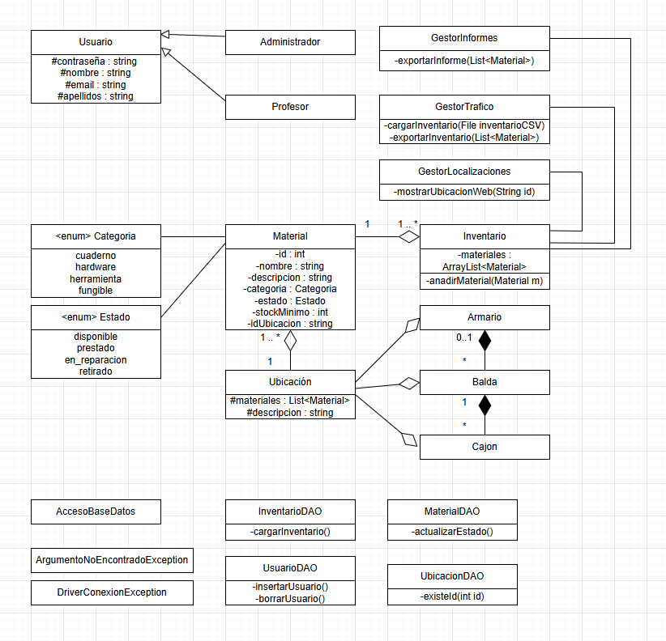

# RETO-DAM1-Equipo3

[](Programacion/Manual%20de%20usuario/Manual%20de%20usuario.pdf)
[](Base%20de%20Datos/BaseDeDatos.sql)
[](Guia_despliegue_Equipo3.pdf)
[](Documentación_Técnica_Web.pdf)
[](https://github.com/ManuelGE55/RETO-DAM1-Equipo3)

# Gestión y Localización del Material del Taller de Informática

---

# Introducción

Este proyecto corresponde al reto intermodular desarrollado por el Equipo 3 de DAM1 del IES Miguel Herrero Pereda.

El objetivo principal del proyecto es desarrollar un sistema completo de gestión de inventario para el taller de informática, permitiendo administrar materiales, controlar ubicaciones físicas, gestionar usuarios y facilitar la organización del almacén mediante una aplicación de escritorio conectada a una infraestructura cloud desplegada en AWS.

El sistema combina varias tecnologías y áreas de conocimiento trabajadas durante el curso:

- Programación orientada a objetos en Java.
- Bases de datos relacionales en MySQL.
- Infraestructura cloud mediante AWS Academy.
- Desarrollo web con HTML, CSS y JavaScript.
- Administración de sistemas Linux.
- Documentación técnica profesional.
- Trabajo colaborativo con GitHub.

---

# Índice

1. [Descripción del proyecto](#descripción-del-proyecto)
2. [Objetivos del proyecto](#objetivos-del-proyecto)
3. [Integrantes del equipo](#integrantes-del-equipo)
4. [Tecnologías utilizadas](#tecnologías-utilizadas)
5. [Arquitectura general](#arquitectura-general)
6. [Base de datos](#base-de-datos)
7. [Aplicación de escritorio](#aplicación-de-escritorio)
8. [Sitio web](#sitio-web)
9. [Infraestructura AWS](#infraestructura-aws)
10. [Diagramas del proyecto](#diagramas-del-proyecto)
11. [Funcionalidades implementadas](#funcionalidades-implementadas)
12. [Seguridad implementada](#seguridad-implementada)
13. [Despliegue y conectividad](#despliegue-y-conectividad)
14. [Resultados obtenidos](#resultados-obtenidos)
15. [Documentación disponible](#documentación-disponible)
16. [Organización del equipo](#organización-del-equipo)
17. [Dificultades encontradas](#dificultades-encontradas)
18. [Mejoras futuras](#mejoras-futuras)
19. [Webgrafía](#webgrafía)

---

# Descripción del reto

El proyecto “Gestión y Localización del Material del Taller de Informática” consiste en el desarrollo de una aplicación de escritorio realizada en Java Swing conectada a una base de datos MySQL alojada en AWS.

La aplicación permite gestionar de forma centralizada:

- Inventario del taller.
- Registro de materiales.
- Ubicación física de componentes.
- Gestión de usuarios.
- Gestión de préstamos.
- Control de stock mínimo.
- Exportación e importación de datos.
- Generación automática de informes.
- Visualización gráfica de ubicaciones mediante una página web.

Toda la infraestructura se encuentra desplegada sobre instancias EC2 de AWS Academy, utilizando Ubuntu Server, MySQL, Apache2 y OpenSSH.

---

# Objetivos del proyecto

Los principales objetivos planteados durante el desarrollo del reto fueron:

- Diseñar una base de datos relacional completa en MySQL.
- Aplicar programación orientada a objetos en Java.
- Implementar patrones de diseño como DAO y Singleton.
- Crear una interfaz gráfica funcional y sencilla de utilizar.
- Gestionar usuarios mediante roles.
- Desarrollar un sistema de inventario funcional.
- Desplegar servidores en AWS Academy.
- Configurar servicios Linux y administración remota.
- Trabajar de forma colaborativa mediante GitHub.
- Elaborar documentación técnica profesional.

---

# Integrantes del equipo

- Saúl Valdunciel
- Naya Ruiz
- Ciro Galán
- Manuel González
- Hugo Fernández

---

# Tecnologías utilizadas

| Tecnología | Utilidad en el proyecto |
|---|---|
| Java | Desarrollo de la aplicación principal |
| Swing | Interfaz gráfica de escritorio |
| MySQL | Base de datos relacional |
| JDBC | Conexión Java-MySQL |
| HTML5 | Estructura de la página web |
| CSS3 | Diseño visual y estilos |
| JavaScript | Interactividad web |
| XML/XSLT | Procesamiento y exportación de datos |
| Git/GitHub | Control de versiones |
| AWS Academy | Infraestructura cloud |
| EC2 | Servidores virtuales |
| Apache2 | Servidor web |
| OpenSSH | Administración remota |
| SCP/SFTP | Transferencia segura de archivos |
| NetBeans | Desarrollo Java |
| VS Code | Desarrollo web y Markdown |
| MySQL Workbench | Gestión visual de la base de datos |

---

# Arquitectura general

El proyecto se encuentra dividido en varios módulos independientes que trabajan conjuntamente:

## Base de datos MySQL

Encargada de almacenar toda la información del inventario, materiales, usuarios, movimientos y ubicaciones.

## Aplicación Java Swing

Aplicación principal utilizada por los usuarios para gestionar el inventario.

## Sitio web

Página web visual utilizada para representar gráficamente las ubicaciones físicas del material.

## Infraestructura AWS

Conjunto de servidores desplegados sobre AWS Academy utilizando instancias EC2.

## Documentación técnica

Conjunto de manuales, diagramas y guías utilizadas para documentar el funcionamiento completo del proyecto.

---

# Base de datos

La base de datos fue desarrollada utilizando MySQL.

Se diseñó una estructura relacional orientada al control completo del inventario del taller.

## Entidades principales

- Usuarios.
- Profesores.
- Administradores.
- Materiales.
- Categorías.
- Ubicaciones.
- Movimientos.
- Alertas de stock.

## Funcionalidades implementadas

- Relaciones entre tablas mediante claves foráneas.
- Triggers automáticos.
- Control de stock mínimo.
- Registro automático de movimientos.

## Diagramas relacionados

### Diagrama E/R


### Modelo relacional


## Documentación

[📄 Ver documentación de base de datos](Base%20de%20Datos/Documentación%20Base%20de%20datos.pdf)

[📄 Ver Script SQL](Base%20de%20Datos/BaseDeDatos.sql)

---

# Aplicación de escritorio

La aplicación principal fue desarrollada en Java utilizando Swing y NetBeans.

El objetivo de la aplicación es permitir la administración completa del inventario mediante una interfaz gráfica sencilla y funcional.

## Funcionalidades principales

### Gestión de materiales

- Añadir materiales.
- Modificar materiales.
- Eliminar materiales.
- Consultar información.
- Filtrar inventario.

### Gestión de usuarios

- Registro de usuarios.
- Eliminación de usuarios.
- Roles diferenciados.
- Control de permisos.

### Gestión de inventario

- Búsquedas.
- Filtros.
- Gestión de stock.
- Alertas automáticas.
- Ubicación física de materiales.

### Exportación e importación

- Exportación CSV.
- Importación CSV/Excel.
- Generación de informes TXT.
- Generación automática de JSON.

## Patrones utilizados

### DAO

Separación entre lógica de negocio y acceso a base de datos.

### Singleton

Control centralizado de conexiones y recursos.

## Diagramas relacionados

### Diagrama de clases



### Diagrama de casos de uso


## Documentación técnica

[📄 Manual de usuario](Programacion/Manual%20de%20usuario/Manual%20de%20usuario.pdf)

[📄 JavaDoc](./docs/index.html)

---

# Sitio web

La página web fue desarrollada utilizando HTML5, CSS3 y JavaScript.

Su finalidad principal es representar visualmente la distribución física del taller y facilitar la localización rápida del material.

## Características de la web

- Visualización de armarios.
- Visualización de baldas.
- Visualización de cajones.
- Diseño responsive básico.
- Integración con inventario.
- Navegación visual.

## Tecnologías utilizadas

- HTML5.
- CSS3.
- JavaScript.

## Documentación

[📄 Ver documentación técnica web](Documentación_Técnica_Web.pdf)

---

# Infraestructura AWS

La infraestructura cloud del proyecto fue desplegada completamente sobre AWS Academy.

## Arquitectura implementada

- VPC personalizada.
- Internet Gateway.
- Security Groups.
- Elastic IP.
- Balanceador de carga ALB.
- Dos subredes públicas.
- Servidor MySQL.
- Dos servidores web.

## Servidores desplegados

### EC2-1 – Servidor de datos

Funciones principales:

- Alojamiento MySQL.
- Persistencia de datos.
- Acceso remoto SSH.
- Almacenamiento de scripts SQL.

Servicios instalados:

- Ubuntu Server.
- MySQL Server.
- OpenSSH.

### EC2-2 y EC2-3 – Servidores web

Funciones principales:

- Alojamiento web.
- Balanceo de carga.
- Transferencia SFTP.
- Administración remota.

Servicios instalados:

- Ubuntu Server.
- Apache2.
- OpenSSH.

---

# Diagramas del proyecto

## Diagrama de arquitectura AWS


El diagrama representa la infraestructura desplegada en AWS Academy, incluyendo VPC, subredes, balanceador de carga, servidores EC2 y servidor MySQL.

---

# Funcionalidades implementadas

## Inventario

- CRUD completo de materiales.
- Gestión de categorías.
- Gestión de ubicaciones.
- Búsquedas y filtros.

## Usuarios

- Login.
- Roles.
- Registro.
- Eliminación.

## Informes

- Exportación TXT.
- Exportación CSV.
- Importación CSV.
- JSON automático.

## Web

- Visualización del taller.
- Localización visual de materiales.

## Infraestructura

- SSH.
- SFTP.
- Apache2.
- Balanceador ALB.

---

# Seguridad implementada

Las principales medidas de seguridad implementadas en el proyecto fueron:

- Restricción SSH por IP.
- Uso de claves `.pem`.
- Deshabilitación de acceso root.
- Uso de protocolos cifrados.
- Security Groups personalizados.
- Separación de servicios mediante instancias independientes.

---

# Despliegue y conectividad

La administración remota de los servidores se realiza mediante SSH utilizando autenticación mediante clave privada `.pem`.

## Protocolos utilizados

- SSH.
- SCP.
- SFTP.

## Puertos principales

| Puerto | Servicio |
|---|---|
| 22 | SSH/SFTP |
| 80 | HTTP |
| 443 | HTTPS |
| 3306 | MySQL |

## Administración remota

Ejemplo de conexión SSH:

```bash
ssh -i "Reto.pem" ubuntu@IP_SERVIDOR
```

Ejemplo de transferencia SCP:

```bash
scp -i Reto.pem -r web ubuntu@IP:/home/ubuntu/
```

## Guía completa

[📄 Ver Guía de despliegue](Guia_despliegue_Equipo3.pdf)

---

# Resultados obtenidos

Durante el desarrollo del reto se consiguió:

- Aplicación Java completamente funcional.
- Base de datos MySQL operativa.
- Infraestructura AWS desplegada.
- Página web accesible.
- Gestión de inventario operativa.
- Conectividad SSH/SFTP funcional.
- Balanceador de carga funcionando.
- Integración completa entre módulos.
- Documentación técnica completa.

---

# Documentación disponible

| Documento | Descripción |
|---|---|
| Manual de usuario | Funcionamiento de la aplicación |
| Guía de despliegue | Infraestructura AWS y servidores |
| Documentación web | Funcionamiento interno de la web |
| JavaDoc | Documentación automática del código |
| Script SQL | Base de datos completa |

## Accesos rápidos

[📄 Manual de Usuario](Programacion/Manual%20de%20usuario/Manual%20de%20usuario.pdf)

[📄 Script SQL](Base%20de%20Datos/BaseDeDatos.sql)

[📄 Guía de despliegue](Guia_despliegue_Equipo3.pdf)

[📄 Documentación técnica web](Documentación_Técnica_Web.pdf)

[📄 JavaDoc](./docs/index.html)

---

# Organización del equipo

Para la organización y coordinación del proyecto se utilizaron diferentes herramientas colaborativas.

## Herramientas utilizadas

- GitHub.
- GitHub Projects.
- GitHub Issues.
- Repositorios compartidos.
- Control de versiones.
- Reuniones periódicas.

## Metodología de trabajo

- División de tareas.
- Trabajo por módulos.
- Sincronización continua.
- Documentación progresiva.
- Testing colaborativo.

---

# Dificultades encontradas

Las principales dificultades encontradas durante el desarrollo del proyecto fueron:

- Configuración de AWS.
- Security Groups.
- Conectividad JDBC.
- Integración Java-MySQL.
- Administración Linux.
- Balanceador de carga.
- Organización del trabajo colaborativo.
- Gestión de dependencias y despliegue.

A pesar de ello, el proyecto pudo completarse correctamente gracias al trabajo conjunto del equipo.

---

# Mejoras futuras

Algunas posibles mejoras futuras del sistema serían:

- Migración completa a subred privada.
- Sistema de copias de seguridad automáticas.
- Panel web administrativo.
- Gestión avanzada de préstamos.
- Integración con API REST.
- Sistema de autenticación cifrada.
- Mejoras visuales en la interfaz.
- Estadísticas y gráficas.
- Generación PDF de informes.
- Notificaciones automáticas.

---

# Webgrafía

- https://docs.aws.amazon.com/
- https://ubuntu.com/server/docs
- https://httpd.apache.org/docs/
- https://dev.mysql.com/doc/
- https://docs.oracle.com/en/java/
- https://www.openssh.com/manual.html
- https://github.com/
- https://developer.mozilla.org/
- https://www.w3schools.com/sql/
- https://netbeans.apache.org/
- https://code.visualstudio.com/docs
